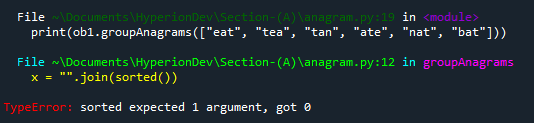
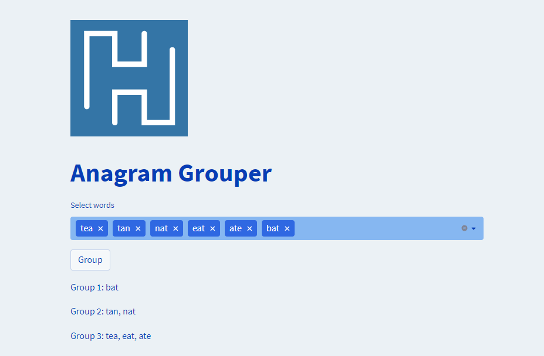

## Section A: Code Review
### Option 1: Python Task
Hey there, I have reviewed your code and I have to say the code looks good. I can see we are making progress. Although your function looks good, there are still some minor things we need to fix, so let's see.

Before we begin, remember that this code is supposed to group anagrams in a list of strings. Anagrams are words that have the same letters but in different orders. So in summary, the `Solution` class in this code defines a method that groups anagrams in a list of strings, and an instance of the class is used to call this method on an input list of strings. The `groupAnagrams()` method uses a dictionary to store the anagram groups and returns a list of these groups.
### Feedback
#### Syntax error
So I ran your code:
```
class Solution:
       def groupAnagrams(self, strs):
      result = {}
      for i in strs:
         x = "".join(sorted())
         if x in result:
            result[x].append(i)
         else:
            result[x] = [i]
      return list(result.values())
ob1 = Solution()
print(ob1.groupAnagrams(["eat", "tea", "tan", "ate", "nat", "bat"]))
```
this is the first error i came across


This is a common error in Python and can be frustrating. I recommend that you use an integrated development environment (IDE) that automatically inserts the correct amount of indentation and highlights any indentation errors, such as:
- Visual Studio Code
- PyCharm
- Sublime Text
- Atom
- IDLE (included with Python).


Or you can take your cursor to the end of the function code right after the `colons(:)` and hit enter. It will show you where you're supposed to start your code.

So I fixed the indentation error and ran it again, and that's when I saw the real issue. This is what I got from running your code:



the error in the code is that the `sorted()` function on line 5 is called without passing any argument, so it will raise a `TypeError`. Instead, it should sort the letters in the current word `i`, so it should be `sorted(i)`.


Once the `sorted()` function is corrected to `sorted(i)`, the code should work as expected, grouping the anagrams in the list of input strings and returning a list of the anagram groups.

#### Logic error ####
The other error I came across is with the expected output. This error is not a syntax error. The function runs fine and returns a list as it should, but not in the order that is expected.


see the `groupAnagrams()` function sorts the letters in each word and groups them together based on the sorted letters. In this case, "bat" is the only word that does not have any anagrams, so it gets its own group. "nat", "tan", "ate", "eat", and "tea" all have the same letters when sorted, so they are grouped together.
To obtain the expected output of `[["bat"],["nat","tan"],["ate","eat","tea"]]`, you can sort the list of anagram groups based on the length of each group, with the smallest groups coming first
so in `Line 10` of the code you can add `sorted(code,key =len)`.


This will sort the anagram groups by length in ascending order, with the smallest group (in this case, `["bat"]`) appearing first, followed by the next smallest group (`["nat", "tan"]`), and finally the largest group (`["ate", "eat", "tea"]`) appearing last.


This is the expected output, so well done! 🎉🥳👍

Here are some of the things you should look-out for 
### Documentation
Adding comments or docstrings to your code can make it easier for others (or even yourself, when returning to the code later) to understand the purpose and functionality of your classes, methods and blocks of code. For example, in your groupAnagrams() method, you could add a brief comment at the top explaining what the method does, the parameters it expects and the output it returns. Similarly, you could add a docstring to describe the purpose of the Solution class.

### Efficiency
Your implementation is reasonably efficient, since you're only looping through the input list once, which is news for the time complexity of your function.

### Style
Python code should follow the conventions set out in the PEP8 style guide. These conventions include guidelines on variable and function naming, indentation, line length, and other aspects of code formatting. It's a good practice to make sure your code conforms to these guidelines to make it easier for others to read and understand. Many code editors, such as Visual Studio Code or PyCharm, have plugins that can automatically check and highlight formatting issues in your code.

### The Use of While loop ###
I Sent you the corrected code with comments on every line for more understanding
There is another cool way of implementing the function using a `while loop` instead of a `for loop`.
for interest sake allow me to explain
**note:** i have have added the file to the code am about to show incase you want to go back


Here is what each line of the code does:

- `anagram_groups` = [ ]: Creates an empty list to store anagram groups.
- `i = 0`: Initializes a loop index to 0.
- `while i < len(strs):`: Begins a loop that will continue until the end of the input list is reached.
- `word = strs[i]:` Selects the current word for comparison.
- `anagram_group = [word]:` Initializes a new anagram group with the current word.
- `j = i + 1:` Initializes an inner loop index to the next position.
- `while j < len(strs)::` Begins a loop that will continue until the end of the input list is reached.
- `other_word = strs[j]:` Selects the next word for comparison.
- `if sorted(other_word) == sorted(word):`: Checks if the words have the same sorted letter sequence.
- `anagram_group.append(other_word):` Adds the word to the current anagram group.
- `strs.pop(j):` Removes the word from the input list.
- `else:`: If the words do not have the same sorted letter sequence:
- `j += 1`: Moves to the next word in the input list.
- `i += 1`: Moves to the next word in the input list.
- `anagram_groups.append(anagram_group)`: Adds the current anagram group to the list of anagram groups.
- `return anagram_groups`: Returns the list of anagram groups.

### Streamlit ###
I've created a web application to demonstrate how the function works in practice. Follow these instructions to install and run the web app, and enjoy!
follow the steps below by running the given commands within a Git bash (Windows), or terminal (Mac/Linux):
1. Ensure that you have the prerequisite Python libraries installed on your local machine:

 ```bash
 pip install -U streamlit 
 ```

 2. Clone the  repo to your local machine.

 ```bash
 git clone https://github.com/philiase/HyperionDev.git
 ```  

 3. Navigate to the base of the cloned repo, and start the Streamlit app.

 ```bash
 cd Section_A/
 streamlit run Demo_App.py
 ```

 If the web server was able to initialise successfully, the following message should be displayed within your bash/terminal session:

```
  You can now view your Streamlit app in your browser.

  Local URL: http://localhost:8501
  Network URL: http://192.168.0.101:8501
```

You should also be automatically directed to the base page of your web app. This should look something like:



## Thank you!


